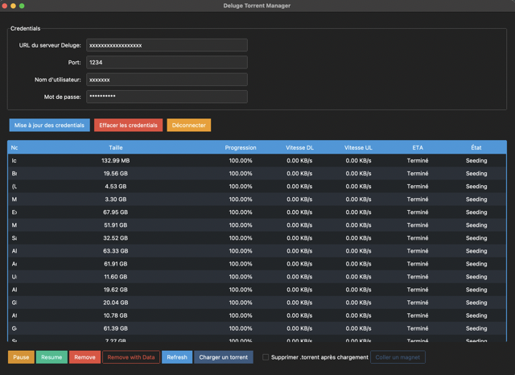

# Deluge Torrent Manager

[](https://semver.org)
[](https://creativecommons.org/licenses/by/4.0/)

**Note for English-speaking users:**
This application is currently available in French only. An English version is planned for a future update. Thank you for your understanding.

**Note pour les utilisateurs francophones :**
Cette application est actuellement disponible uniquement en français. Une version anglaise est prévue pour une mise à jour future.

<p align="center">
  
</p>

Deluge Torrent Manager est une application graphique pour gérer vos torrents via l'API Deluge. Elle offre une interface conviviale pour interagir avec votre serveur Deluge à distance.

Deluge est un client BitTorrent multiplateforme et open-source. Il peut être utilisé en mode autonome ou en tant que service de démon.

Mon application est conçue pour se connecter à un serveur Deluge distant via http ou https.

Voir la [documentation de Deluge](https://deluge-torrent.org/about/)

## Fonctionnalités clés

- Connexion à un serveur Deluge distant par http ou https
- Interface utilisateur intuitive
- Gestion des torrents à distance: pause, reprise, suppression
- Support des fichiers .torrent et des liens magnet
- Option pour supprimer automatiquement les fichiers .torrent de votre appareil après ajout
- Compatible avec Windows, macOS et Linux

## Configuration requise

- Système d'exploitation : Windows 7+, macOS 10.12+, ou Linux avec interface graphique
- Serveur Deluge configuré et accessible à distance

## Table des matières

1. [Pour les utilisateurs](#pour-les-utilisateurs)
   - [Installation](#installation)
   - [Utilisation](#utilisation)
2. [Pour les développeurs](#pour-les-développeurs)
   - [Prérequis](#prérequis)
   - [Installation de l'environnement de développement](#installation-de-lenvironnement-de-développement)
   - [Exécution en mode développement](#exécution-en-mode-développement)
   - [Installation et exécution rapides](#installation-et-exécution-rapides)
   - [Compilation](#compilation)
3. [Licence](#licence)

## Pour les utilisateurs

### Installation

#### Windows

1. Téléchargez [ce fichier .exe](https://github.com/Crypt0zauruS/deluge-manager/releases/download/v0.2.0/DelugeManager-v0.2.0-Windows-x64.exe).
2. Double-cliquez sur `DelugeManager.exe` pour lancer l'application.

#### macOS

1. Téléchargez [ce fichier dmg](https://github.com/Crypt0zauruS/deluge-manager/releases/download/v0.2.0/DelugeManager-v0.2.0-macOS-arm64.dmg) si vous êtes sur Mac Apple Silicon, ou [ce fichier dmg](https://github.com/Crypt0zauruS/deluge-manager/releases/download/v0.2.0/DelugeManager-v0.2.0-macOS-x64.dmg) si vous êtes sur Mac Intel.
2. Ouvrez le DMG puis déplacez `DelugeManager.app` dans votre dossier Applications.
3. Double-cliquez sur `DelugeManager.app` pour lancer l'application.

#### Linux

1. Téléchargez [ce fichier exécutable](https://github.com/Crypt0zauruS/deluge-manager/releases/download/v0.2.0/DelugeManager-v0.2.0-linux-ubuntu20.04-x64).
2. Ouvrez un terminal et naviguez vers le dossier contenant le fichier téléchargé.
3. Renommez le fichier exécutable :

```bash
mv DelugeManager-v0.2.0-linux-ubuntu20.04-x64 DelugeManager
```

3. Rendez le fichier exécutable : `chmod +x DelugeManager`
4. Lancez l'application : `./DelugeManager`

### Utilisation

1. Lancez l'application Deluge Torrent Manager.
2. Entrez les informations de connexion de votre serveur Deluge :
   - URL du serveur
   - Port
   - Nom d'utilisateur
   - Mot de passe
3. Cliquez sur "Connexion".
4. A la première connexion, votre système vous demandera si vous souhaitez enregistrer les informations de connexion en accédant à votre trousseau de clés (Keychain sur macOS, Gestionnaire de clés sur Linux, etc.). Pas d'inquiétude, cela sert à enregistrer votre mot de passe Deluge de manière sécurisée via la fonctionnalité de stockage sécurisé de votre système.
5. Une fois connecté, vous pouvez gérer vos torrents : ajouter, supprimer, mettre en pause, reprendre, etc.

## Pour les développeurs

### Prérequis

- Python 3.7 ou supérieur

Assurez-vous que Python est correctement installé en exécutant :

```bash
python --version
```

Si Python n'est pas installé, téléchargez-le depuis [le site officiel](https://www.python.org/downloads/).

Sur MacOS, vous pouvez également utiliser [Homebrew](https://brew.sh/) pour installer Python :

```bash
brew install python
```

Sur linux, vous pouvez utiliser votre gestionnaire de paquets pour installer Python :

```bash
sudo apt update && sudo apt upgrade -y
sudo apt install python3 python3-pip -y
```

- dépendances supplémentaires pour linux, notamment en environnement wsl :

```bash
sudo apt-get install python3-tk libtk8.6 libopenjp2-7
```

- Git (optionnel, pour cloner le dépôt)

### Installation de l'environnement de développement

1. Clonez le dépôt ou téléchargez les sources :

```bash
git clone https://github.com/votre-username/DelugeManager.git
cd DelugeManager
```

2. Créez un environnement virtuel :

```bash
python -m venv venv
```

Si cette commande échoue, vérifiez que Python est correctement installé et que le module `venv` est disponible.

3. Activez l'environnement virtuel :

- Windows :

```bash
venv\Scripts\activate
```

- macOS/Linux :

```bash
source venv/bin/activate
```

4. Installez les dépendances :

```bash
pip install -r requirements.txt
```

Si vous rencontrez des problèmes lors de la création de l'environnement virtuel :

- Sur Windows : venv est déjà installé avec Python mais assurez-vous que Python est ajouté à votre PATH système.

- Sur Linux : Vous pourriez avoir besoin d'installer le paquet `python3-venv`. Sur Ubuntu ou Debian, utilisez :

```bash
sudo apt-get install python3-venv
```

- Sur MacOS, venv est déjà installé avec Python3.

### Exécution en mode développement

Après avoir activé l'environnement virtuel, exécutez :

```bash
python deluge_manager/main.py
```

### Installation et exécution rapides

Si vous avez tous les prérequis installés, vous pouvez utiliser les scripts fournis pour installer les dépendances et lancer l'application.

### Pour Windows :

1. Double-cliquez sur `install.bat` pour installer les dépendances.
2. Une fois l'installation terminée, double-cliquez sur `run.bat` pour lancer l'application.

### Pour macOS et Linux :

1. Ouvrez un terminal dans le dossier du projet.
2. Rendez les scripts exécutables :

```bash
chmod +x install.sh run.sh
```

3. Exécutez le script d'installation :

```bash
./install.sh
```

4. Une fois l'installation terminée, lancez l'application avec :

```bash
./run.sh
```

### Compilation

Si vous souhaitez compiler vous-même l'application en un exécutable, vous pouvez utiliser PyInstaller.

Tout d'abord, si ce n'est pas déjà fait, créer et activer l'environnement virtuel dans le répertoire du projet :

1. création de l'environnement virtuel :

```bash
python -m venv venv
```

2. activation de l'environnement virtuel :

- Windows :

```bash
venv\Scripts\activate
```

- macOS/Linux :

```bash
source venv/bin/activate
```

3. puis installer les dépendances dans l'environnement virtuel :

```bash
pip install -r requirements.txt
```

- puis installer PyInstaller :

```bash
pip install pyinstaller
```

4. Enfin compilez L'application:

#### Windows

```bash
pyinstaller --onefile --windowed --icon=icon.ico deluge_manager/main.py --name DelugeManager
```

#### Linux

```bash
pyinstaller --onefile --windowed deluge_manager/main.py --name DelugeManager
```

En cas de difficulté sous Linux, et si vous avez bien installé tous les prérequis, vous pouvez utiliser le script `compile-linux.sh` dans l'environnement virtuel :

```bash
chmod +x compile-linux.sh
./compile-linux.sh
```

#### macOS

```bash
pyinstaller --onefile --windowed --icon=icon.icns deluge_manager/main.py --name DelugeManager --osx-bundle-identifier=org.deluge.manager
```

Note: sous MacOS vous obtiendrez l'app mais aussi l'executable brut pour le terminal dans le dossier /dist.

Si vous êtes sous Apple Silicon, vous pouvez compiler pour l'architecture Intel 64-bit :

- en suivant les instructions [ici](Intel_64_compilation_on_Apple_Silicon_guide.md).
- ou en essayant directement avec les commandes suivantes, sans garantie de succès :

```bash
pyinstaller --onefile --target-arch x86_64 --windowed --icon=icon.icns deluge_manager/main.py --name DelugeManager --osx-bundle-identifier=org.deluge.manager
```

5. Désactivez l'environnement virtuel :

```bash
deactivate
```

#### L'exécutable compilé se trouvera dans le dossier `dist`.

#### Notes générales

1. Si vous devez recommencer la compilation, assurez-vous de supprimer les dossiers `dist` et `build` avant de relancer PyInstaller pour bien nettoyer les anciennes tentatives.

2. Si vous souhaitez supprimer l'environnement virtuel pour nettoyer votre projet, vous pouvez le faire en exécutant :

```bash
rm -rf venv
```

3. Sous MacOS, vous pouvez générer un DMG personnalisé pour l'application en utilisant le script `create-dmg.sh`. Voir le fichier [DMG_creation_guide.md](DMG_creation_guide.md) pour plus de détails.

4. Vous pouvez créer les icônes personnalisés icon.ico et icon.icns à partir de votre propre fichier `.png` au format carré en utilisant mon outil [Icon Maker](https://github.com/Crypt0zauruS/icon-maker) si vous êtes sous MacOS.

## Licence

Ce projet est sous licence Creative Commons Attribution 4.0 International (CC BY 4.0). Voir le fichier [LICENSE.md](LICENSE.md) pour plus de détails.
