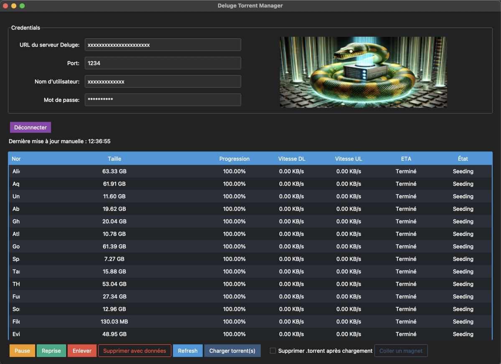
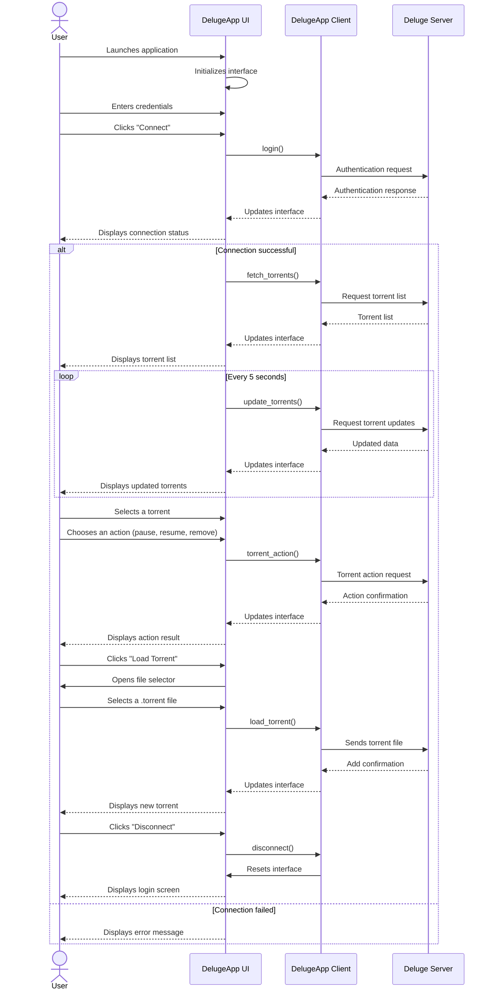

# Deluge Torrent Manager

[](https://semver.org)
[](https://creativecommons.org/licenses/by/4.0/)

<p align="center">
  
</p>

<hr/>

### English

Deluge Torrent Manager is a graphical application to manage your torrents via the Deluge API. It provides a user-friendly interface to interact with your Deluge server remotely.

Deluge is a cross-platform, open-source BitTorrent client. It can be used as a standalone application or as a daemon service.

My application is designed to connect to a remote Deluge server via http or https.

See the [Deluge documentation](https://deluge-torrent.org/about/)

### Français

Deluge Torrent Manager est une application graphique pour gérer vos torrents via l'API Deluge. Elle offre une interface conviviale pour interagir avec votre serveur Deluge à distance.

Deluge est un client BitTorrent multiplateforme et open-source. Il peut être utilisé en mode autonome ou en tant que service de démon.

Mon application est conçue pour se connecter à un serveur Deluge distant via http ou https.

Voir la [documentation de Deluge](https://deluge-torrent.org/about/)

<hr/>

## Sequence Diagram / Diagramme de séquence



<hr/>
<details>
<summary><h2 style="display: inline-block">English (Click to expand)</h2></summary>

## Key Features

- Connect to a remote Deluge server via http or https
- Intuitive user interface
- Remote torrent management: pause, resume, delete
- Support for .torrent files and magnet links
- Option to automatically delete .torrent files from your device after adding
- Compatible with Windows, macOS, and Linux (Ubuntu and derivatives)

## System Requirements

- Operating System: Windows 10+, macOS 12+, or Linux with graphical interface (Ubuntu 20.04+ and derivatives)
- Deluge server configured and accessible remotely

## Table of Contents

1. [For Users](#for-users)
   - [Installation](#installation)
   - [Usage](#usage)
2. [For Developers](#for-developers)
   - [Prerequisites](#prerequisites)
   - [Development Environment Setup](#development-environment-setup)
   - [Running in Development Mode](#running-in-development-mode)
   - [Quick Installation and Execution](#quick-installation-and-execution)
   - [Compilation](#compilation)
3. [License](#license)

## For Users

### Installation

#### Windows

1. Download the [installer](https://github.com/Crypt0zauruS/deluge-manager/releases/download/v0.3.0/DelugeManager-v0.3.0-Windows-x64-Setup.exe).
2. Double-click to install the application. Read the information displayed carefully. An uninstaller will also be added to your system.

#### macOS

1. Download [this dmg file](https://github.com/Crypt0zauruS/deluge-manager/releases/download/v0.3.0/DelugeManager-v0.3.0-macOS-arm64.dmg) if you're on Mac Apple Silicon, or [this dmg file](https://github.com/Crypt0zauruS/deluge-manager/releases/download/v0.3.0/DelugeManager-v0.3.0-macOS-x64.dmg) if you're on Mac Intel.
2. Open the DMG and move `DelugeManager.app` to your Applications folder.
3. Double-click on `DelugeManager.app` to launch the application.

#### Linux (Ubuntu and derivatives)

1. Download [this tar file](https://github.com/Crypt0zauruS/deluge-manager/releases/download/v0.3.0/DelugeManager-v0.3.0-linux-ubuntu20.04-x64.tar).
2. Extract the contents of the tar file.
3. Read the Installation Guide for more information.
4. Open a terminal and navigate to the extracted folder.
5. Make the installation script executable:

```bash
chmod +x ./linux-install.sh
```

6. Run the installation in sudo mode:

   ```bash
   sudo ./linux-install.sh
   ```

You can then launch the application by searching for "DelugeManager" in your applications menu.

### Usage

1. Launch the Deluge Torrent Manager application.
2. Enter your Deluge server connection information:
   - Server URL
   - Port
   - Username
   - Password
3. Click "Connect".
4. On first connection, your system will ask if you want to save the connection information by accessing your keychain (Keychain on macOS, Key Manager on Linux, etc.). Don't worry, this is to securely save your Deluge password using your system's secure storage feature.
5. Once connected, you can manage your torrents: add, delete, pause, resume, etc.

## For Developers

### Prerequisites

- Python 3.10 or higher

Ensure Python is correctly installed by running:

```bash
python --version
```

If Python is not installed, download it from [the official website](https://www.python.org/downloads/).

On MacOS, you can also use [Homebrew](https://brew.sh/) to install Python:

```bash
brew install python
```

On Linux (Ubuntu and derivatives), you can use your package manager to install Python:

```bash
sudo apt update && sudo apt upgrade -y
sudo apt install python3 python3-pip -y
```

- Additional dependencies for Linux, especially in a WSL environment:

```bash
sudo apt-get install python3-tk libtk8.6 libopenjp2-7
```

- Git (optional, for cloning the repository)

### Development Environment Setup

1. Clone the repository or download the sources:

```bash
git clone https://github.com/your-username/DelugeManager.git
cd DelugeManager
```

2. Create a virtual environment:

```bash
python -m venv venv
```

If this command fails, verify that Python is correctly installed and the `venv` module is available.

3. Activate the virtual environment:

- Windows:

```bash
venv\Scripts\activate
```

- macOS/Linux:

```bash
source venv/bin/activate
```

4. Install dependencies:

```bash
pip install -r requirements.txt
```

If you encounter problems creating the virtual environment:

- On Windows: venv is already installed with Python but make sure Python is added to your system PATH.

- On Linux: You might need to install the `python3-venv` package. On Ubuntu or Debian, use:

```bash
sudo apt-get install python3-venv
```

- On MacOS, venv is already installed with Python3.

### Running in Development Mode

After activating the virtual environment, run:

```bash
python deluge_manager/main.py
```

### Quick Installation and Execution

If you have all the prerequisites installed, you can use the provided scripts to install dependencies and launch the application.

#### For Windows:

1. Double-click on `install.bat` to install dependencies.
2. Once installation is complete, double-click on `run.bat` to launch the application.

#### For macOS and Linux:

1. Open a terminal in the project folder.
2. Make the scripts executable:

```bash
chmod +x install.sh run.sh
```

3. Run the installation script:

```bash
./install.sh
```

4. Once installation is complete, launch the application with:

```bash
./run.sh
```

### Compilation

If you want to compile the application into an executable yourself, you can use PyInstaller.

1. First, if not already done, create and activate the virtual environment in the project directory and install dependencies:

On Windows:

```bash
./install.bat
```

On MacOS and Linux:

```bash
chmod +x install.sh
./install.sh
```

2. Make sure you are in the virtual environment:

'(venv)' should appear in your terminal.
If not, activate the virtual environment:

- On MacOS and Linux:

```bash
source venv/bin/activate
```

- on Windows powershell:

```bash
.\venv\Scripts\Activate
```

- on Windows Command Prompt:

```bash
venv\Scripts\activate
```

3. Then install PyInstaller:

```bash
pip install pyinstaller
```

4. Finally compile the application:

```bash
pyinstaller DelugeManager.spec
```

#### Notes for macOS

Note: on MacOS you will get the app but also the raw executable for the terminal in the /dist folder.

If you are on Apple Silicon, you can compile for Intel 64-bit architecture by following the instructions [here](docs/Intel_64_compilation_on_Apple_Silicon_guide.md).

5. Deactivate the virtual environment:

```bash
deactivate
```

#### The compiled executable will be in the `dist` folder.

#### General Notes

1. If you need to recompile, make sure to delete the `dist` and `build` folders before relaunching PyInstaller to clean up old attempts.

2. If you want to remove the virtual environment to clean up your project, you can do so by running:

```bash
rm -rf venv
```

3. On MacOS, you can generate a custom DMG for the application using the `create-dmg.sh` script. See the [DMG_creation_guide.md](docs/DMG_creation_guide.md) file for more details.

4. You can create custom icon.ico and icon.icns icons as well as icons for Linux from your own square `.png` file using my [Icon Maker](https://github.com/Crypt0zauruS/icon-maker) tool if you are on MacOS.

- rename your png to `icon.png`

- run the `iconmaker.sh` script

```bash
./iconmaker.sh /path/to/your/icon.png
```

- copy the `icon.ico` and/or `icon.icns` files and/or the `linux_icons` directory to the root of the project (this depends on the platforms you want to compile for).

5. On Linux, you can install your freshly compiled application using the provided `linux-install.sh` script.

- Ensure the presence of the `dist` and `linux_icons` directories in the project directory.
- Make sure the script is executable:

```bash
chmod +x ./linux-install.sh
```

Run the script in sudo mode:

```bash
sudo ./linux-install.sh
```

## License

This project is licensed under the Creative Commons Attribution 4.0 International (CC BY 4.0). See the [LICENSE.md](LICENSE.md) file for more details.

</details>
<hr/>
<details>
<summary><h2 style="display: inline-block">Français (Cliquez pour déplier)</h2></summary>

## Fonctionnalités clés

- Connexion à un serveur Deluge distant par http ou https
- Interface utilisateur intuitive
- Gestion des torrents à distance: pause, reprise, suppression
- Support des fichiers .torrent et des liens magnet
- Option pour supprimer automatiquement les fichiers .torrent de votre appareil après ajout
- Compatible avec Windows, macOS et Linux (Ubuntu et dérivés)

## Configuration requise

- Système d'exploitation : Windows 10+, macOS 12+, ou Linux avec interface graphique (Ubuntu 20.04+ et dérivés)
- Serveur Deluge configuré et accessible à distance

## Table des matières

1. [Pour les utilisateurs](#pour-les-utilisateurs)
   - [Installation](#installation)
   - [Utilisation](#utilisation)
2. [Pour les développeurs](#pour-les-développeurs)
   - [Prérequis](#prérequis)
   - [Installation de l'environnement de développement](#installation-de-lenvironnement-de-développement)
   - [Exécution en mode développement](#exécution-en-mode-développement)
   - [Installation et exécution rapides](#installation-et-exécution-rapides)
   - [Compilation](#compilation)
3. [Licence](#licence)

## Pour les utilisateurs

### Installation

#### Windows

1. Téléchargez [l'installateur](https://github.com/Crypt0zauruS/deluge-manager/releases/download/v0.3.0/DelugeManager-v0.3.0-Windows-x64-Setup.exe).
2. Double-cliquez dessus pour installer l'application. Lisez bien les informations qui s'afficheront. Un désinstallateur sera également ajouté à votre système.

#### macOS

1. Téléchargez [ce fichier dmg](https://github.com/Crypt0zauruS/deluge-manager/releases/download/v0.3.0/DelugeManager-v0.3.0-macOS-arm64.dmg) si vous êtes sur Mac Apple Silicon, ou [ce fichier dmg](https://github.com/Crypt0zauruS/deluge-manager/releases/download/v0.3.0/DelugeManager-v0.3.0-macOS-x64.dmg) si vous êtes sur Mac Intel.
2. Ouvrez le DMG puis déplacez `DelugeManager.app` dans votre dossier Applications.
3. Double-cliquez sur `DelugeManager.app` pour lancer l'application.

#### Linux (Ubuntu et dérivés)

1. Téléchargez [ce fichier tar](https://github.com/Crypt0zauruS/deluge-manager/releases/download/v0.3.0/DelugeManager-v0.3.0-linux-ubuntu20.04-x64.tar).
2. Extrayez le contenu du fichier tar.
3. Lisez le Guide d'Installation pour plus d'informations.
4. Ouvrez un terminal et naviguez vers le dossier décompressé.
5. Rendez le script d'installation exécutable :

```bash
chmod +x ./linux-install.sh
```

6. Lancez l'installation en mode sudo:

   ```bash
   sudo ./linux-install.sh
   ```

Vous pourrez ensuite lancer l'application en cherchant "DelugeManager" dans votre menu d'applications.

### Utilisation

1. Lancez l'application Deluge Torrent Manager.
2. Entrez les informations de connexion de votre serveur Deluge :
   - URL du serveur
   - Port
   - Nom d'utilisateur
   - Mot de passe
3. Cliquez sur "Connexion".
4. A la première connexion, votre système vous demandera si vous souhaitez enregistrer les informations de connexion en accédant à votre trousseau de clés (Keychain sur macOS, Gestionnaire de clés sur Linux, etc.). Pas d'inquiétude, cela sert à enregistrer votre mot de passe Deluge de manière sécurisée via la fonctionnalité de stockage sécurisé de votre système.
5. Une fois connecté, vous pouvez gérer vos torrents : ajouter, supprimer, mettre en pause, reprendre, etc.

## Pour les développeurs

### Prérequis

- Python 3.10 ou supérieur

Assurez-vous que Python est correctement installé en exécutant :

```bash
python --version
```

Si Python n'est pas installé, téléchargez-le depuis [le site officiel](https://www.python.org/downloads/).

Sur MacOS, vous pouvez également utiliser [Homebrew](https://brew.sh/) pour installer Python :

```bash
brew install python
```

Sur linux (Ubuntu et dérivés), vous pouvez utiliser votre gestionnaire de paquets pour installer Python :

```bash
sudo apt update && sudo apt upgrade -y
sudo apt install python3 python3-pip -y
```

- dépendances supplémentaires pour linux, notamment en environnement wsl :

```bash
sudo apt-get install python3-tk libtk8.6 libopenjp2-7
```

- Git (optionnel, pour cloner le dépôt)

### Installation de l'environnement de développement

1. Clonez le dépôt ou téléchargez les sources :

```bash
git clone https://github.com/votre-username/DelugeManager.git
cd DelugeManager
```

2. Créez un environnement virtuel :

```bash
python -m venv venv
```

Si cette commande échoue, vérifiez que Python est correctement installé et que le module `venv` est disponible.

3. Activez l'environnement virtuel :

- Windows :

```bash
venv\Scripts\activate
```

- macOS/Linux :

```bash
source venv/bin/activate
```

4. Installez les dépendances :

```bash
pip install -r requirements.txt
```

Si vous rencontrez des problèmes lors de la création de l'environnement virtuel :

- Sur Windows : venv est déjà installé avec Python mais assurez-vous que Python est ajouté à votre PATH système.

- Sur Linux : Vous pourriez avoir besoin d'installer le paquet `python3-venv`. Sur Ubuntu ou Debian, utilisez :

```bash
sudo apt-get install python3-venv
```

- Sur MacOS, venv est déjà installé avec Python3.

### Exécution en mode développement

Après avoir activé l'environnement virtuel, exécutez :

```bash
python deluge_manager/main.py
```

### Installation et exécution rapides

Si vous avez tous les prérequis installés, vous pouvez utiliser les scripts fournis pour installer les dépendances et lancer l'application.

### Pour Windows :

1. Double-cliquez sur `install.bat` pour installer les dépendances.
2. Une fois l'installation terminée, double-cliquez sur `run.bat` pour lancer l'application.

### Pour macOS et Linux :

1. Ouvrez un terminal dans le dossier du projet.
2. Rendez les scripts exécutables :

```bash
chmod +x install.sh run.sh
```

3. Exécutez le script d'installation :

```bash
./install.sh
```

4. Une fois l'installation terminée, lancez l'application avec :

```bash
./run.sh
```

### Compilation

Si vous souhaitez compiler vous-même l'application en un exécutable, vous pouvez utiliser PyInstaller.

1. Tout d'abord, si ce n'est pas déjà fait, créer et activer l'environnement virtuel dans le répertoire du projet puis installer les dépendances :

Sous Windows :

```bash
./install.bat
```

Sous MacOS et Linux :

```bash
chmod +x install.sh
./install.sh
```

2. Assurer-vous que vous êtes dans l'environnement virtuel :

'(venv)' doit apparaître dans votre terminal.
Si ce n'est pas le cas, activez l'environnement virtuel :

- Sous MacOS et Linux :

```bash
source venv/bin/activate
```

- sous Windows powershell:

```bash
.\venv\Scripts\Activate
```

- sous Windows Command Prompt :

```bash
venv\Scripts\activate
```

3. puis installer PyInstaller :

```bash
pip install pyinstaller
```

4. Enfin compilez L'application:

```bash
pyinstaller DelugeManager.spec
```

#### Notes pour macOS

Note: sous MacOS vous obtiendrez l'app mais aussi l'executable brut pour le terminal dans le dossier /dist.

Si vous êtes sous Apple Silicon, vous pouvez compiler pour l'architecture Intel 64-bit en suivant les instructions [ici](docs/Intel_64_compilation_on_Apple_Silicon_guide.md).

5. Désactivez l'environnement virtuel :

```bash
deactivate
```

#### L'exécutable compilé se trouvera dans le dossier `dist`.

#### Notes générales

1. Si vous devez recommencer la compilation, assurez-vous de supprimer les dossiers `dist` et `build` avant de relancer PyInstaller pour bien nettoyer les anciennes tentatives.

2. Si vous souhaitez supprimer l'environnement virtuel pour nettoyer votre projet, vous pouvez le faire en exécutant :

```bash
rm -rf venv
```

3. Sous MacOS, vous pouvez générer un DMG personnalisé pour l'application en utilisant le script `create-dmg.sh`. Voir le fichier [DMG_creation_guide.md](docs/DMG_creation_guide.md) pour plus de détails.

4. Vous pouvez créer les icônes personnalisés icon.ico et icon.icns ainsi que les icônes pour Linux à partir de votre propre fichier `.png` au format carré en utilisant mon outil [Icon Maker](https://github.com/Crypt0zauruS/icon-maker) si vous êtes sous MacOS.

- renommez votre png en `icon.png`

- lancer le script `iconmaker.sh`

```bash
./iconmaker.sh /path/to/your/icon.png
```

- copier les fichiers `icon.ico` et/ou `icon.icns` et/ou le répertoire `linux_icons` dans la racine du projet (cela dépend des plateformes pour lesquelles vous souhaitez compiler).

5. Sous Linux, vous pouvez installer votre application fraichement compilée en utilisant le script `linux-install.sh` fourni.

- Assurez-vous de la présence des répertoires `dist` et `linux_icons` dans le répertoire du projet.
- Assurez-vous que le script est exécutable :

```bash
chmod +x ./linux-install.sh
```

Lancez le script en mode sudo :

```bash
sudo ./linux-install.sh
```

## Licence

Ce projet est sous licence Creative Commons Attribution 4.0 International (CC BY 4.0). Voir le fichier [LICENSE.md](LICENSE.md) pour plus de détails.

</details>
